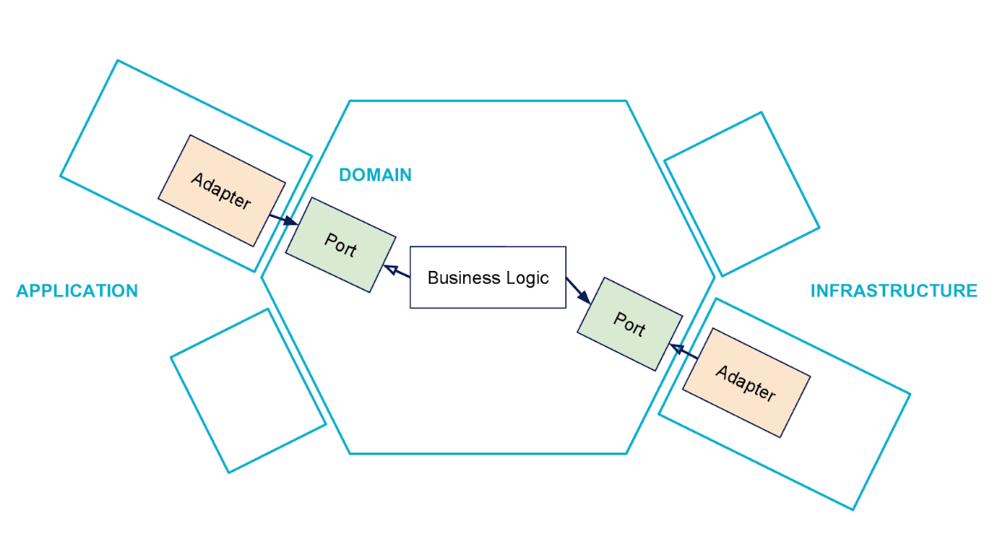

# Take home task

Implement API endpoints allowing users to register and self-declare their "identity". In order to keep things simple, an identity will be represented by a nationality and an Ethereum address.

This is a backend exercise so developing a front-end is **not required**. Feel free to create a very simple one but it is not necessarily needed, we won't evaluate you on that.

Here's what users should be able to do, using the API:

- Signing up with username and password.
    - A user can only have one username.
    - Two users cannot register the same username.
- Submitting their identity which only contains 2 properties: their Ethereum address and their country, using the alpha-3 ISO-3166 format (a list is available [here](https://github.com/lukes/ISO-3166-Countries-with-Regional-Codes/blob/master/slim-3/slim-3.json)). This should be done after having signed up. An identity cannot be partially submitted, i.e both properties need to be submitted at the same time. A user can only have 1 identity and an ethereum address cannot appear in 2 different identities.
- Viewing the identity they have registered: a user should only be able to view her identity, and only if logged in.

Additionally, your application should expose a public endpoint that takes an Ethereum address as input and returns the country associated with it, or an empty response if the Ethereum address was never registered.

You must use either TypeScript or Go but are free to use whatever way of storing data you see fit and whatever tools / frameworks you want. However, while picking an Authentication framework that does all the heavy lifting out-of-the-box would help complete the exercise faster, it wouldn't help in showcasing your coding skills!

Not in scope:

- Updating username, password, country or Ethereum address
- Forgot password flow

## Solution

###Usage
One button startup. Server will be available on `localhost:8080` To run web-server execute:
```
make up
```

Generate server after spec changes:
```
make gen-server
```

Tests:
```
make test
```

New migration:
```
make new-migration name={your_migration_name}
```

Apply migrations locally:
```
make migrate-local
```

###Overview
The application follows common go application layout: [github](https://github.com/golang-standards/project-layout)  

Server API contract implemented in swagger. The spec can be found in
`/api/spec/server.yaml`  


Http server is generated by [go-swagger](https://github.com/go-swagger/go-swagger).

### Architecture
The architecture of choice is [hexagonal](https://blog.octo.com/en/hexagonal-architecture-three-principles-and-an-implementation-example/) architecture. It will add speed, organization and shareability of resources among serverless microservices and golang applications.

As per the diagram below.



- Application code lives in the **cmd** folder
- Anything shared such as DB repos and models located in the **pkg** folder
- Any app specific code to allow cmd to talk to pkg will are in the **internal** directory.

###Authoruzation
For faster development authorization is performed against `username:password` pair that has to be provided in `Authorization` header

Passwords are stored in database as salted hashes and checks are performed againt those hashes.

###Development tools and infrastructure
 - Application ships as docker container and could be deployed to any infrastructure with minimal effort.
 - It depends on Postgres database instance to store data. Image for development purposes can be found in `docker-compose.yaml`
 - Code is covered by tests layer by layer. Files have their corresponding _test.go
 - Repository tests create fresh test containers, apply migrations and then apply fixture. All testing infrastructure can be found in `pkg/test_utils`.
 - Code is linted by `golangci-lint`. To run linter use `make lint`
 - Migrations located in `/migrations` and designed to be applied by [go-migrate](https://github.com/golang-migrate/migrate)
 - Mocks are marked with annotation on interface, which requiers a mock. Mocks are generated by [golang-mock](https://github.com/golang/mock)
 - All code goes through common golang toolchain:
 ` go fmt ./...`
  `go vet ./...`

### Usage
```
Usage:
  identity [OPTIONS]

Application Options:
      --scheme=            the listeners to enable, this can be repeated and defaults to the schemes in the swagger spec
      --cleanup-timeout=   grace period for which to wait before killing idle connections (default: 10s)
      --graceful-timeout=  grace period for which to wait before shutting down the server (default: 15s)
      --max-header-size=   controls the maximum number of bytes the server will read parsing the request header's keys and values, including the request line. It does not limit the size of the
                           request body. (default: 1MiB)
      --socket-path=       the unix socket to listen on (default: /var/run/identity.sock)
      --host=              the IP to listen on (default: localhost) [$HOST]
      --port=              the port to listen on for insecure connections, defaults to a random value [$PORT]
      --listen-limit=      limit the number of outstanding requests
      --keep-alive=        sets the TCP keep-alive timeouts on accepted connections. It prunes dead TCP connections ( e.g. closing laptop mid-download) (default: 3m)
      --read-timeout=      maximum duration before timing out read of the request (default: 30s)
      --write-timeout=     maximum duration before timing out write of the response (default: 60s)
      --tls-host=          the IP to listen on for tls, when not specified it's the same as --host [$TLS_HOST]
      --tls-port=          the port to listen on for secure connections, defaults to a random value [$TLS_PORT]
      --tls-certificate=   the certificate to use for secure connections [$TLS_CERTIFICATE]
      --tls-key=           the private key to use for secure connections [$TLS_PRIVATE_KEY]
      --tls-ca=            the certificate authority file to be used with mutual tls auth [$TLS_CA_CERTIFICATE]
      --tls-listen-limit=  limit the number of outstanding requests
      --tls-keep-alive=    sets the TCP keep-alive timeouts on accepted connections. It prunes dead TCP connections ( e.g. closing laptop mid-download)
      --tls-read-timeout=  maximum duration before timing out read of the request
      --tls-write-timeout= maximum duration before timing out write of the response

db:
      --db.username=       Db connection username
      --db.password=       Db connection password
      --db.dbname=         Database name
      --db.port=           Db connection port
      --db.host=           Db connection host

Help Options:
  -h, --help               Show this help message
```